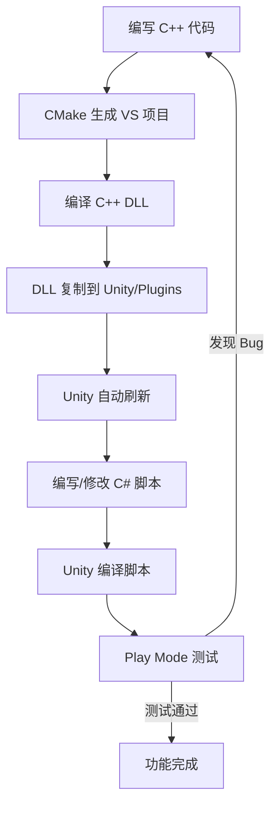

# 极地科考破冰船模拟仿真环境 - 编译与构建说明

## 1. 系统要求

### 1.1 硬件要求
- **操作系统**: Windows 10/11 64-bit
- **处理器**: Intel Core i7-8700K / AMD Ryzen 7 3700X 或更高
- **内存**: 16GB RAM (推荐 32GB)
- **显卡**: NVIDIA GeForce GTX 1660 / AMD Radeon RX 580 或更高
- **磁盘空间**: 10GB 可用空间

### 1.2 软件要求
- **Unity**: Unity 2021.3 LTS 或更高版本
- **C++ 编译器**: Microsoft Visual Studio 2019/2022 (Community/Professional/Enterprise)
  - 必须安装 "使用 C++ 的桌面开发" 工作负载
  - 包含 MSVC v142/v143 编译器
  - Windows 10/11 SDK
- **CMake**: 3.15 或更高版本
- **Git**: 2.0 或更高版本 (可选)

---

## 2. 项目结构

```
07-icebreaker-physics-sim/
├── IcePhysicsEngine/              # C++ 物理引擎 DLL 项目
│   ├── CMakeLists.txt           # CMake 构建脚本
│   ├── include/                 # 头文件 (8 个)
│   │   ├── IcePhysicsAPI.h
│   │   ├── MathUtils.h
│   │   ├── RigidBody.h
│   │   ├── Collider.h
│   │   ├── CollisionDetection.h
│   │   ├── Hydrodynamics.h
│   │   ├── Voronoi.h
│   │   └── PhysicsWorld.h
│   └── src/                     # 源文件 (7 个)
│       ├── RigidBody.cpp
│       ├── Collider.cpp
│       ├── CollisionDetection.cpp
│       ├── Hydrodynamics.cpp
│       ├── Voronoi.cpp
│       ├── PhysicsWorld.cpp
│       └── IcePhysicsAPI.cpp
│
├── UnityProject/                  # Unity 项目
│   ├── Assets/
│   │   ├── Plugins/           # 编译后的 DLL 放置目录
│   │   └── Scripts/           # C# 脚本 (6 个)
│   │       ├── IcePhysicsInterop.cs
│   │       ├── IcePhysicsManager.cs
│   │       ├── IcebreakerShip.cs
│   │       ├── IceSheet.cs
│   │       ├── IceFragment.cs
│   │       └── DebugHUD.cs
│   └── ProjectSettings/
│
├── Docs/                          # 文档目录
│   ├── MultiLayerArchitecture.md
│   └── BuildInstructions.md    # 本文档
│
└── README.md
```

---

## 3. C++ DLL 编译步骤

### 3.1 方法一：使用 CMake (推荐)

#### 步骤 1: 安装依赖项
确保已安装：
1. Visual Studio 2019/2022 及 C++ 开发工具
2. CMake 3.15+

#### 步骤 2: 配置构建
打开 PowerShell 或命令提示符，进入项目目录：

```powershell
cd d:\SOLO-0619-3\07-icebreaker-physics-sim\IcePhysicsEngine
```

创建构建目录：
```powershell
mkdir build
cd build
```

#### 步骤 3: 生成 Visual Studio 项目
```powershell
cmake .. -G "Visual Studio 17 2022" -A x64
```

> **注意**: 
> - Visual Studio 2022 使用: `-G "Visual Studio 17 2022"`
> - Visual Studio 2019 使用: `-G "Visual Studio 16 2019"`
> - 确保使用 `-A x64` 指定 64 位架构

#### 步骤 4: 编译 DLL
```powershell
cmake --build . --config Release
```

编译成功后，DLL 将被自动复制到 Unity 插件目录：
```
UnityProject/Assets/Plugins/IcePhysicsEngine.dll
```

#### 步骤 5: (可选) 使用 Visual Studio IDE
```powershell
# 打开生成的解决方案
start IcePhysicsEngine.sln
```

在 Visual Studio 中：
1. 选择 Release 配置，x64 平台
2. 按 F7 或点击 "生成解决方案"

### 3.2 方法二：使用 Visual Studio 直接编译

如果不想使用 CMake，可以手动创建 Visual Studio 项目：

1. 打开 Visual Studio，创建新的 "Dynamic-Link Library (DLL)" 项目
2. 项目名称: IcePhysicsEngine
3. 位置: d:\SOLO-0619-3\07-icebreaker-physics-sim\IcePhysicsEngine
4. 添加所有 `.cpp` 文件到 "源文件" 过滤器
5. 添加所有 `.h` 文件到 "头文件" 过滤器
6. 配置项目属性：
   - C/C++ → 常规 → 附加包含目录: `$(ProjectDir)include`
   - C/C++ → 预处理器 → 预处理器定义: 添加 `ICEPHYSICS_EXPORTS`
   - 链接器 → 常规 → 输出文件: `$(SolutionDir)..\..\UnityProject\Assets\Plugins\IcePhysicsEngine.dll`
   - 配置管理器: 选择 Release, x64
7. 生成项目 (F7)

### 3.3 验证编译结果

编译成功后，检查以下文件是否存在：
```
d:\SOLO-0619-3\07-icebreaker-physics-sim\UnityProject\Assets\Plugins\IcePhysicsEngine.dll
```

---

## 4. Unity 项目配置

### 4.1 打开 Unity 项目

1. 启动 Unity Hub
2. 点击 "Add" 或 "Open"
3. 选择目录: `d:\SOLO-0619-3\07-icebreaker-physics-sim\UnityProject`
4. 等待 Unity 导入资源 (首次可能需要几分钟)

### 4.2 验证 DLL 导入设置

1. 在 Unity Project 窗口中，导航到 `Assets/Plugins/`
2. 选中 `IcePhysicsEngine.dll`
3. 在 Inspector 窗口中确认：
   - **Platform**: Windows
   - **CPU**: x86_64
   - **OS**: Windows
   - **Plugin Type**: Native
4. 如果修改了，点击 "Apply"

### 4.3 创建场景

#### 步骤 1: 创建主场景

1. File → New Scene
2. 保存为 `MainScene.unity` 到 `Assets/Scenes/`

#### 步骤 2: 创建物理管理器

1. GameObject → Create Empty
2. 重命名为 `IcePhysicsManager`
3. Add Component → Scripts → Ice Physics Manager
4. 在 Inspector 中配置参数：
   - **Fixed Timestep**: 0.01667 (60Hz)
   - **Debug Level**: Info
   - **Auto Initialize**: ✓

#### 步骤 3: 创建破冰船

1. GameObject → 3D Object → Cube (作为船体占位)
2. 重命名为 `IcebreakerShip`
3. 设置 Scale: (13.4, 1.5, 2.5)
4. Add Component → Scripts → Icebreaker Ship
5. 在 Inspector 中配置参数：
   - **Mass**: 20000000 (2万吨)
   - **Hull Length**: 134
   - **Hull Beam**: 25
   - **Hull Draft**: 9
   - **Hull Wetted Area**: 3500
   - **Max Engine Power**: 48500000 (48.5 MW)
   - **Max Rudder Angle**: 35
   - **Max Speed Knots**: 21

#### 步骤 4: 创建冰层

1. GameObject → Create Empty
2. 重命名为 `IceSheet`
3. 设置 Position: (0, 0, 100)
4. Add Component → Scripts → Ice Sheet
5. 在 Inspector 中配置参数：
   - **Ice Sheet Size**: (200, 1.5, 200)
   - **Yield Strength**: 1500000 (1.5 MPa)
   - **Subdivisions**: 64
   - **Ice Density**: 917
   - **Target Ship**: 拖拽 IcebreakerShip 对象到此处

#### 步骤 5: 创建调试 HUD

1. GameObject → UI → Canvas
2. 重命名为 `DebugHUD`
3. Add Component → Scripts → Debug HUD
4. 在 Inspector 中配置：
   - **Font Size**: 14
   - **Show Stats Panel**: ✓
   - **Show Ship State**: ✓
   - **Show Ice Info**: ✓
   - **Show Log Panel**: ✓
   - **Max Log Entries**: 100
   - **Key Code**: F1

#### 步骤 6: 配置摄像机

1. 选中 Main Camera
2. 设置 Position: (0, 5, -10)
3. 设置 Rotation: (20, 0, 0)
4. 或使用 Free Look Camera 跟随船舶

#### 步骤 7: 添加光照

1. Window → Rendering → Lighting
2. 配置合适的天空盒和光照设置

---

## 5. 完整构建流程

### 5.1 开发环境构建



### 5.2 发布构建

#### 步骤 1: 配置 Player Settings
1. Edit → Project Settings → Player
2. **Other Settings**:
   - Scripting Backend: IL2CPP (可选，提升性能)
   - API Compatibility Level: .NET Standard 2.1
3. **Resolution and Presentation**:
   - Default Screen Width: 1920
   - Default Screen Height: 1080

#### 步骤 2: 构建
1. File → Build Settings
2. 选择 Windows, Windows, x86_64
3. 添加 MainScene 到 Scenes In Build
4. 点击 Build
5. 选择输出目录
6. 等待构建完成

---

## 6. 常见编译问题

### 6.1 CMake 找不到编译器

**错误**:
```
CMake Error at CMakeLists.txt:xx (project):
  No CMAKE_C_COMPILER could be found.
```

**解决方案**:
1. 确认已安装 Visual Studio 2019/2022
2. 确认已安装 "使用 C++ 的桌面开发" 工作负载
3. 打开 "Developer Command Prompt for VS 2022" 再运行 CMake
4. 或在 CMake 命令中显式指定编译器：
   ```powershell
   cmake .. -G "Visual Studio 17 2022" -A x64 -DCMAKE_C_COMPILER=cl.exe -DCMAKE_CXX_COMPILER=cl.exe
   ```

### 6.2 编译错误：无法打开包含文件

**错误**:
```
fatal error C1083: Cannot open include file: 'xxx.h': No such file or directory
```

**解决方案**:
1. 确认头文件存在于 `include/` 目录
2. 检查 CMakeLists.txt 中的 include_directories 配置正确
3. 如果手动创建 VS 项目，确认附加包含目录设置为 `$(ProjectDir)include`

### 6.3 Unity 找不到 DLL

**错误**:
```
DllNotFoundException: IcePhysicsEngine
```

**解决方案**:
1. 确认 DLL 存在于 `Assets/Plugins/` 目录
2. 确认 DLL 是 x64 架构
3. 确认 Unity 构建设置为 x86_64
4. 安装 Visual C++ Redistributable for Visual Studio 2015/2019/2022

### 6.4 运行时崩溃

**错误**:
```
EntryPointNotFoundException: IP_Initialize
```

**解决方案**:
1. 确认 C++ 代码中的函数名与 C# 中的 DllImport 名称完全一致
2. 确认使用了 `extern "C"` 防止名称修饰
3. 确认使用了 `ICEPHYSICS_API` 宏正确导出
4. 使用 Dependency Walker 查看 DLL 导出函数

### 6.5 内存损坏或崩溃

**可能原因**:
1. C++ 和 C# 中的结构体定义不一致
2. 调用约定不匹配 (使用 CallingConvention.Cdecl)
3. 数组越界访问
4. 空指针引用

**调试方法**:
1. 在 C++ 代码中添加断言和边界检查
2. 使用 Debug 编译 DLL，在 Visual Studio 中附加到 Unity 进程调试
3. 检查 DebugLogger 输出的详细日志

---

## 7. 调试技巧

### 7.1 C++ DLL 调试

1. 编译 Debug 版本的 DLL:
   ```powershell
   cmake --build . --config Debug
   ```

2. 在 Visual Studio 中打开 IcePhysicsEngine.sln

3. 打开 Unity，打开项目

4. 在 Visual Studio 中:
   - Debug → Attach to Process
   - 选择 Unity.exe 进程
   - 在 C++ 代码中设置断点

5. 在 Unity 中点击 Play 按钮

6. 当调用到 C++ 代码时，断点会触发

### 7.2 Unity C# 调试

1. 在 Unity 中:
   - Edit → Preferences → External Tools
   - 设置 External Script Editor 为 Visual Studio

2. 在 Visual Studio 中打开 C# 脚本

3. 在 C# 代码中设置断点

4. 在 Visual Studio 中:
   - Debug → Attach Unity Debugger
   - 选择 Unity 编辑器实例

5. 在 Unity 中点击 Play

---

## 8. 性能优化构建

### 8.1 Release 构建优化

C++ DLL Release 配置优化：
- C/C++ → Optimization → Optimization: Maximize Speed (/O2)
- C/C++ → Optimization → Favor Size Or Speed: Favor fast code (/Ot)
- C/C++ → Code Generation → Enable Enhanced Instruction Set: Advanced Vector Extensions 2 (/arch:AVX2)

### 8.2 Unity 性能优化

1. Player Settings:
   - Scripting Backend: IL2CPP
   - C++ Compiler Configuration: Release
   - Strip Engine Code: ✓

2. Quality Settings:
   - 降低阴影质量
   - 禁用不必要的后处理效果

3. 代码优化:
   - 使用对象池复用 IceFragment 对象
   - 降低物理迭代次数
   - 减少日志输出

---

## 9. 自动化构建脚本 (PowerShell)

可以使用以下 PowerShell 脚本自动化构建：

```powershell
# BuildIcePhysicsEngine.ps1

param(
    [ValidateSet("Debug", "Release")]
    [string]$Config = "Release"
)

$ErrorActionPreference = "Stop"

Write-Host "Building IcePhysicsEngine ($Config)..." -ForegroundColor Green

$ProjectRoot = Split-Path -Parent $PSScriptRoot
$EngineDir = Join-Path $ProjectRoot "IcePhysicsEngine"
$BuildDir = Join-Path $EngineDir "build"

if (Test-Path $BuildDir) {
    Write-Host "Cleaning build directory..."
    Remove-Item -Recurse -Force $BuildDir
}

New-Item -ItemType Directory -Path $BuildDir | Out-Null

Set-Location $BuildDir

Write-Host "Generating Visual Studio project..."
cmake .. -G "Visual Studio 17 2022" -A x64

if ($LASTEXITCODE -ne 0) {
    throw "CMake generation failed"
}

Write-Host "Compiling DLL..."
cmake --build . --config $Config

if ($LASTEXITCODE -ne 0) {
    throw "Build failed"
}

$DllPath = Join-Path $BuildDir "$Config\IcePhysicsEngine.dll"
if (Test-Path $DllPath) {
    $TargetDir = Join-Path $ProjectRoot "UnityProject\Assets\Plugins"
    if (!(Test-Path $TargetDir)) {
        New-Item -ItemType Directory -Path $TargetDir | Out-Null
    }
    Copy-Item -Force $DllPath (Join-Path $TargetDir "IcePhysicsEngine.dll")
    Write-Host "DLL copied to Unity Plugins directory" -ForegroundColor Green
}

Write-Host "Build completed successfully!" -ForegroundColor Green
```

使用方法：
```powershell
.\BuildIcePhysicsEngine.ps1 -Config Release
```

---

## 10. 验证清单

编译和配置完成后，按照以下清单验证：

### 编译验证:
- [ ] C++ DLL 编译成功，无错误和警告
- [ ] DLL 自动复制到 Unity/Plugins 目录
- [ ] Unity 识别到 DLL，导入设置正确

### Unity 场景验证:
- [ ] IcePhysicsManager GameObject 存在且配置正确
- [ ] IcebreakerShip GameObject 存在，参数合理
- [ ] IceSheet GameObject 存在，Target Ship 已赋值
- [ ] DebugHUD Canvas 存在

### 功能验证:
- [ ] 点击 Play 无报错
- [ ] 控制台显示物理引擎初始化日志
- [ ] WASD 可以控制船舶移动
- [ ] 船舶接近冰层时显示压力分布
- [ ] 船舶撞击冰层时触发破碎
- [ ] 碎块正确生成并下落/漂浮
- [ ] DebugHUD 显示正确的统计信息

---

**文档结束**
